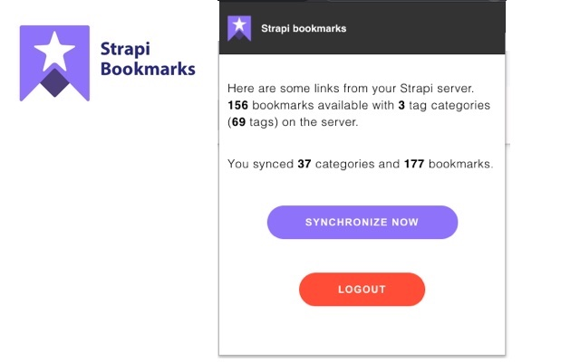
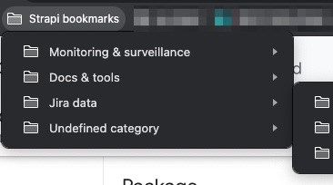

# Strapi bookmarks


## Intro

This extension synchronize with a Strapi server. Cf cf https://github.com/julienfroidefond/bookmarks-cms for the server configured and good to ship.





## Building for chrome

```
yarn
yarn build
```

After that, you will get in the `build` folder the files to put in chrome extension.

## Starting developpment

### Start a strapi local server

- clone the repo at `https://github.com/julienfroidefond/bookmarks-cms`

```
yarn
yarn start
```

### Start the dev server

```
yarn
yarn start
```

Hot reloading for development, but step building is required.

### Attach the extension

- Open the Extension Management page by navigating to chrome://extensions.
- Remove existing xp-client-links extension
- Enable Developer Mode by clicking the toggle switch next to Developer mode.
- Click the "Load unpacked" button and select the extension directory.
- Select the build folder of your project


That's it, when you edit your code, to be sure to see last update on your chrome, use the "reload extension" button on chrome://extensions.

### Roadmap

- [x] Add a button 'restore settings' in options.html
- [x] Make strapi url configurable
- [] Do not recreate rootNode : save its id in config, remove only its childrens on sync
- [] Optim onboarding 😃
- [] Let user select bookmark folders to sync (using tag, category...)
- [] Use up to date strategies : https://developer.chrome.com/docs/extensions/mv3/migrating_to_service_workers/
